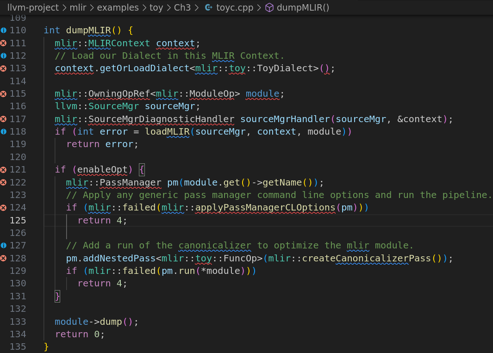

这段代码实现了一个函数 `dumpMLIR`，其主要目的是加载一个 **MLIR** 模块，执行可选的优化操作，并将结果打印出来。下面是详细的解析：

### 1. **函数定义**

```
int dumpMLIR() {
```

- `dumpMLIR` 函数没有参数，返回类型是 `int`，用于执行整个过程并返回错误代码。

### 2. **创建 MLIR 上下文**

```
mlir::MLIRContext context;
```

- 创建一个 `mlir::MLIRContext` 对象，`MLIRContext` 是 MLIR 中管理方言、符号、类型和操作的核心上下文。它是 MLIR 的执行环境，任何操作都必须在这个上下文中创建和执行。

### 3. **加载自定义方言（Dialect）**

```
cpp


复制
context.getOrLoadDialect<mlir::toy::ToyDialect>();
```

- `context.getOrLoadDialect<mlir::toy::ToyDialect>()` 用于加载自定义的 `ToyDialect`。方言是 MLIR 中的一个重要概念，表示一个特定的领域操作集合。在这里，`ToyDialect` 是一个自定义方言，它可能包含特定于 Toy 语言的操作和类型。

### 4. **创建模块引用和源管理器**

```
cpp复制mlir::OwningOpRef<mlir::ModuleOp> module;
llvm::SourceMgr sourceMgr;
mlir::SourceMgrDiagnosticHandler sourceMgrHandler(sourceMgr, &context);
```

- `mlir::OwningOpRef<mlir::ModuleOp> module`：这是一个智能指针，用于持有和管理 `mlir::ModuleOp`（MLIR 模块操作）的生命周期。
- `llvm::SourceMgr sourceMgr`：源管理器（`SourceMgr`）负责管理源文件的内容。
- `mlir::SourceMgrDiagnosticHandler sourceMgrHandler(sourceMgr, &context)`：设置一个诊断处理器，用于将源管理器中的诊断信息（如错误、警告）与 MLIR 上下文关联。这会帮助我们捕获和显示解析错误。

### 5. **加载 MLIR 文件**

```
cpp复制if (int error = loadMLIR(sourceMgr, context, module))
  return error;
```

- `loadMLIR` 是之前讨论的一个函数，负责加载并解析输入文件。
- 如果 `loadMLIR` 返回错误代码，则函数 `dumpMLIR` 也会返回该错误代码。

### 6. **优化处理（如果启用）**

```
cpp复制if (enableOpt) {
  mlir::PassManager pm(module.get()->getName());
  if (mlir::failed(mlir::applyPassManagerCLOptions(pm)))
    return 4;

  pm.addNestedPass<mlir::toy::FuncOp>(mlir::createCanonicalizerPass());
  if (mlir::failed(pm.run(*module)))
    return 4;
}
```

- `enableOpt`

  ：如果启用了优化（即

   

  ```
  enableOpt
  ```

   

  为真），则会进行以下操作：

  - **创建 Pass 管理器**：`mlir::PassManager pm(module.get()->getName())` 创建一个与 `module` 相关联的 Pass 管理器。Pass 管理器用于执行一系列优化或转换操作。
  - **应用命令行选项**：`mlir::applyPassManagerCLOptions(pm)` 用于解析命令行选项并应用到 Pass 管理器。如果应用失败，返回错误代码 `4`。
  - **添加优化 Pass**：`pm.addNestedPass<mlir::toy::FuncOp>(mlir::createCanonicalizerPass())` 向 Pass 管理器中添加一个优化 Pass（`createCanonicalizerPass`）。这个 Pass 是 MLIR 中的标准优化 Pass，它会执行一些常见的 IR 优化，如常量折叠等。
  - **运行 Pass 管理器**：`pm.run(*module)` 执行 Pass 管理器上的优化步骤，如果失败，则返回错误代码 `4`。

### 7. **打印 MLIR 模块**

```
module->dump();
```

- `module->dump()` 用于打印（显示）解析后的 MLIR 模块。这个方法会将模块的内容输出到标准输出中，方便开发者查看生成的 MLIR IR。

### 8. **返回成功状态**

```
return 0;
```

- 如果整个过程成功执行，返回 `0`，表示没有错误发生。

------

### **总结**

- **`dumpMLIR`** 的作用是加载一个 MLIR 模块，进行可选的优化处理，并打印输出结果。
- **加载和解析输入文件**：通过调用 `loadMLIR` 函数来加载并解析输入文件（`.toy` 或 `.mlir`）。
- **优化处理**：如果启用优化 (`enableOpt`)，则使用 Pass 管理器执行优化 Pass，如标准的 **Canonicalizer Pass**。
- **打印输出**：通过 `module->dump()` 将最终的 MLIR 模块输出到控制台。

### **返回值：**

- `0`：表示成功。
- `4`：表示优化过程中发生错误。
- `6`：表示解析 `.toy` 文件失败。
- `-1`：表示文件打开失败。

希望这段解释帮助你理解 `dumpMLIR` 函数的工作原理！如果有任何疑问，请继续提问。