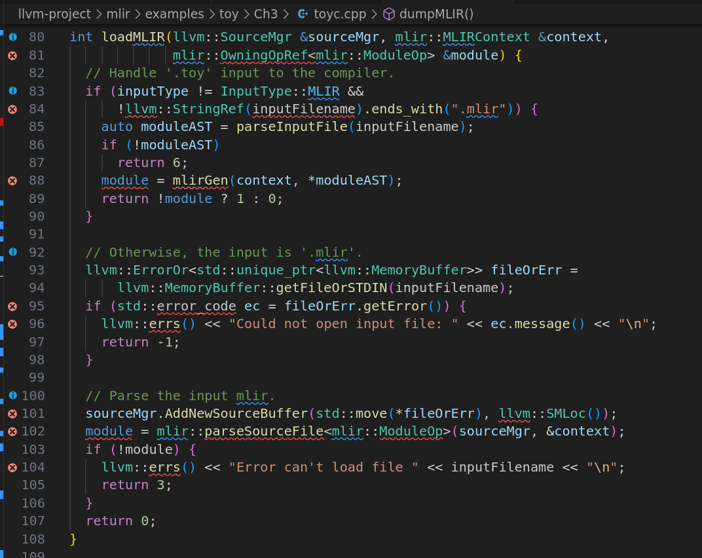

这段代码是一个函数 `loadMLIR`，它用于加载并解析输入文件，处理 `.toy` 文件和 `.mlir` 文件格式的输入。其目的是根据文件类型，将输入文件解析为一个 **MLIR** 模块 (`mlir::ModuleOp`)。

### 代码解析

```
cpp复制int loadMLIR(llvm::SourceMgr &sourceMgr, mlir::MLIRContext &context,
             mlir::OwningOpRef<mlir::ModuleOp> &module) {
```

- 参数说明

  ：

  - `llvm::SourceMgr &sourceMgr`：这是一个 `SourceMgr` 类型的引用，用于管理源文件和其缓冲区的内容。它负责存储并提供输入源文件（比如 `.mlir` 文件）的内容。
  - `mlir::MLIRContext &context`：这是一个 `MLIRContext` 类型的引用，负责管理和存储 MLIR 操作的相关上下文信息（例如，符号表、方言等）。
  - `mlir::OwningOpRef<mlir::ModuleOp> &module`：这是一个 `OwningOpRef<mlir::ModuleOp>` 类型的引用，用于返回解析后的 **MLIR** 模块（`ModuleOp`）对象。`OwningOpRef` 是 MLIR 中用于管理操作对象生命周期的智能指针。

### 1. **处理 `.toy` 输入文件：**

```
cpp复制if (inputType != InputType::MLIR &&
    !llvm::StringRef(inputFilename).ends_with(".mlir")) {
  auto moduleAST = parseInputFile(inputFilename);
  if (!moduleAST)
    return 6;
  module = mlirGen(context, *moduleAST);
  return !module ? 1 : 0;
}
```

- 条件检查

  ：判断输入文件的类型，如果文件不是

   

  ```
  .mlir
  ```

   

  格式的文件，并且输入类型不是

   

  ```
  MLIR
  ```

  ，则会认为这是一个

   

  ```
  .toy
  ```

   

  文件。

  - `inputType != InputType::MLIR`：检查输入文件的类型是否为 `MLIR`，如果不是，则继续处理。
  - `!llvm::StringRef(inputFilename).ends_with(".mlir")`：检查输入文件名是否以 `.mlir` 结尾，如果不是 `.mlir` 文件，则认为它是 `.toy` 文件。

- 解析 `.toy` 文件

  ：

  - `parseInputFile(inputFilename)`：这是一个自定义的函数，用于解析 `.toy` 格式的文件，将其转换为一个抽象语法树（AST）。如果解析失败，则返回错误代码 `6`。
  - `mlirGen(context, *moduleAST)`：调用 `mlirGen` 函数将 `.toy` 格式的 AST 转换为 MLIR 模块。如果转换失败，返回错误代码 `1`；如果成功，返回 `0`。

### 2. **处理 `.mlir` 输入文件：**

```
cpp复制llvm::ErrorOr<std::unique_ptr<llvm::MemoryBuffer>> fileOrErr =
    llvm::MemoryBuffer::getFileOrSTDIN(inputFilename);
if (std::error_code ec = fileOrErr.getError()) {
  llvm::errs() << "Could not open input file: " << ec.message() << "\n";
  return -1;
}
```

- 处理 `.mlir` 文件

  ：

  - `llvm::MemoryBuffer::getFileOrSTDIN(inputFilename)`：尝试打开并读取 `.mlir` 文件（或标准输入）。该函数返回一个 `llvm::ErrorOr` 类型，表示可能会有错误发生。
  - `if (std::error_code ec = fileOrErr.getError())`：检查文件是否成功打开，如果有错误，输出错误信息并返回 `-1`。

### 3. **解析 `.mlir` 文件：**

```
cpp复制sourceMgr.AddNewSourceBuffer(std::move(*fileOrErr), llvm::SMLoc());
module = mlir::parseSourceFile<mlir::ModuleOp>(sourceMgr, &context);
if (!module) {
  llvm::errs() << "Error can't load file " << inputFilename << "\n";
  return 3;
}
```

- 添加源缓冲区

  ：

  - `sourceMgr.AddNewSourceBuffer(std::move(*fileOrErr), llvm::SMLoc())`：将打开的 `.mlir` 文件内容添加到 `sourceMgr` 中，供后续解析使用。`llvm::SMLoc()` 是一个位置对象，表示文件中的源位置。

- 解析文件

  ：

  - `mlir::parseSourceFile<mlir::ModuleOp>(sourceMgr, &context)`：调用 `parseSourceFile` 函数来解析 `.mlir` 文件，将其转换为 `mlir::ModuleOp`（即 MLIR 模块操作）。`sourceMgr` 提供源文件的缓冲区，`context` 提供 MLIR 上下文。
  - 如果解析失败，返回错误代码 `3`。

### 4. **返回结果：**

```
cpp


复制
return 0;
```

- 如果整个过程没有错误，最终返回 `0`，表示成功加载和解析了输入文件。

------

### **总结**

`loadMLIR` 函数的目的是根据输入文件的类型（`.toy` 或 `.mlir`），加载并解析文件：

- 如果是 `.toy` 文件，解析后通过 `mlirGen` 转换为 MLIR 模块。
- 如果是 `.mlir` 文件，直接使用 `mlir::parseSourceFile` 解析文件。
- 处理过程中包含了错误处理机制，以确保如果文件无法打开或解析出错，能够输出错误信息并返回相应的错误代码。

最终，解析结果（即 MLIR 模块）会通过 `module` 参数返回