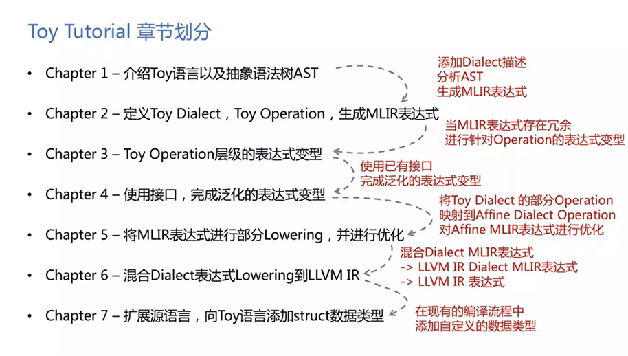
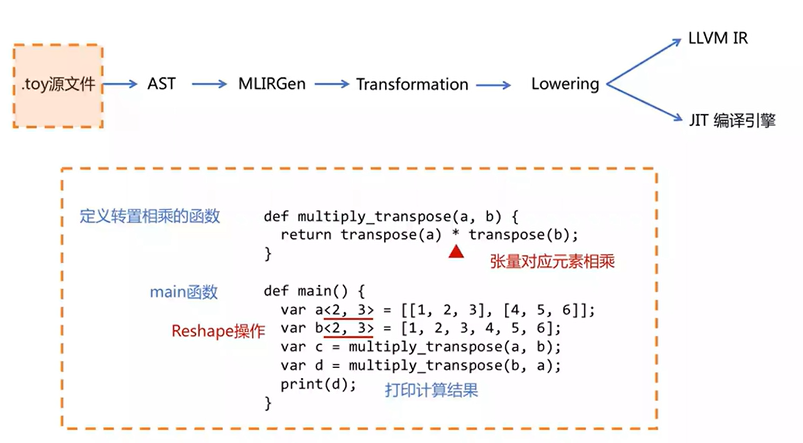
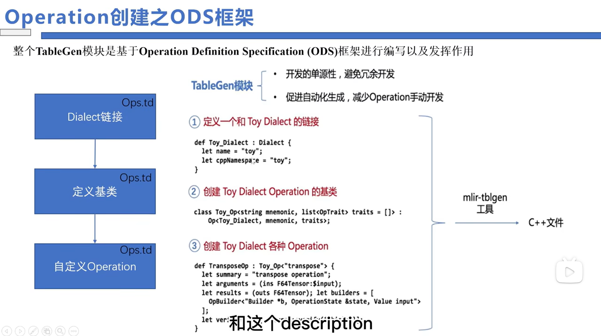
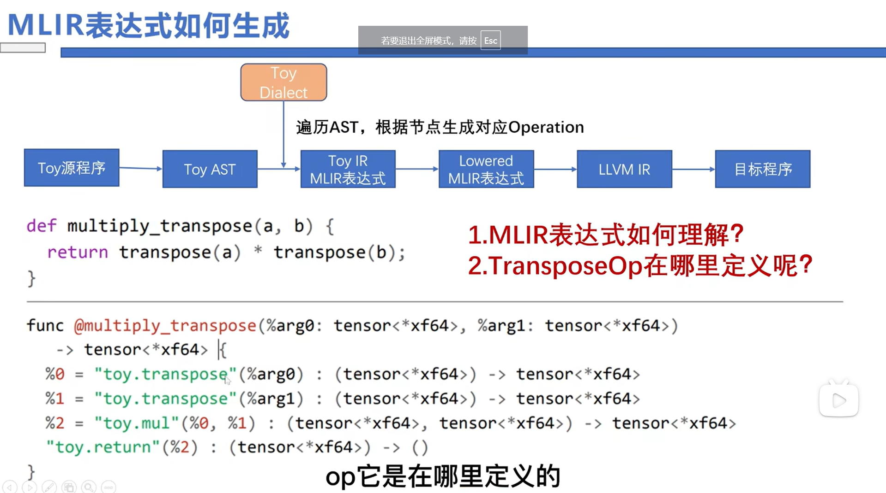
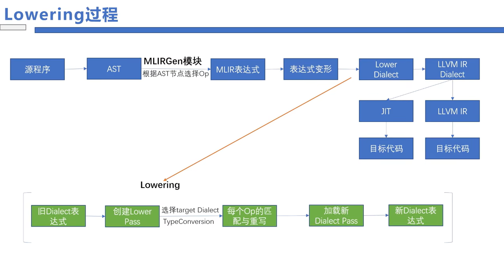
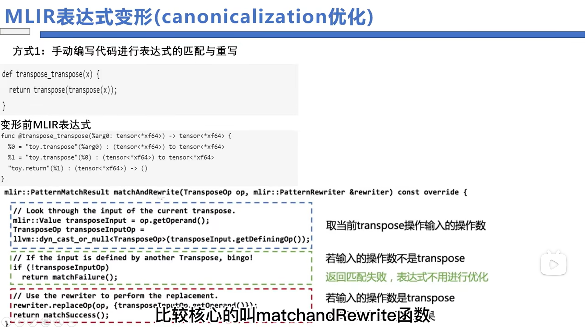
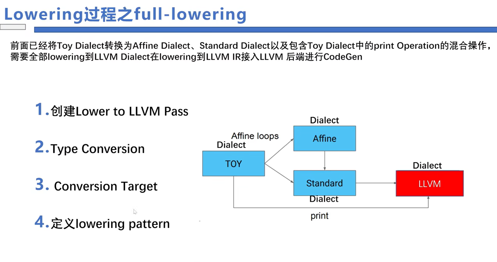

具体来说，Toy Tutorial展示Dialect是如何再Toy语言的分析，表达式变型，Lowering到LLVM的过程中发挥作用的

 ODS框架：使用mlir-tblgen利用.td文件生成class文件的三步走

1. 定义一个Compass Dialect
2. 创建Compass Dialect Operation基类
3. 创建基于Operation基类的各个子类

MLIR如何生成的

使用Lexer和Parser解析生成Compass AST，之后定义Compass Dialect和Operation并使用mlir-tblgen来生成cpp文件，

这样就可以将Compass AST经过Compass Dialect转为Compass Dialect形式的MLIR了

MLIR如何优化：核心函数

matchAndRewrite函数，接受Transpose操作输入进来，然后使用Rewriter对象进行重写

1. 通过op去获得操作数  op.getOperand()
2. 拿到操作数，判断当前操作数是否是input
3. 不是input的话，则调用replaceOp函数去替换transpose op

部分lowering-pattern （为什么使用部分lowering？lowering会丢失掉一些信息，例如Toy::transpose包含print子函数，但是转为Affine::transpose之后，Affine是针对MemRef类型，不再有print函数）

将Toy::transpose转为Affine::transpose

full lowering的四个步骤

经过full和part lowering之后得到下图红色框的Dialect LLVM

不同的Dialect及其关系

红框的Dialect是需要开发者自己去实现的

例如，实现定义Compass Dialect

实现Compass Dialect到MLIR的convertion

